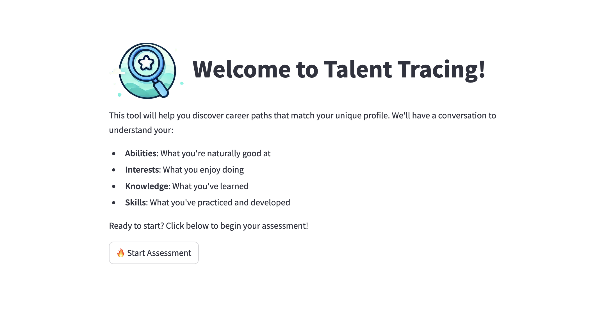
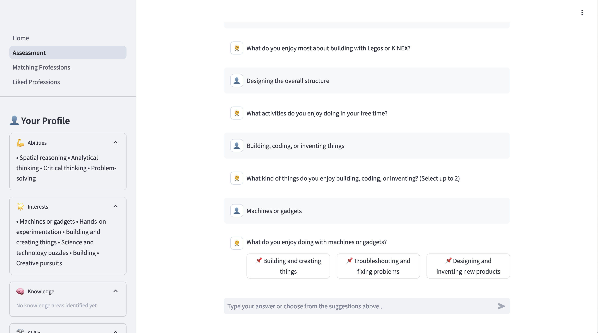

# TalentTracing

Overnight hackathon project to help teenagers explore career options based on their interests and strengths.


## How to run locally

```bash
pip install -r requirements.txt
streamlit run Home.py
```

## Deployed version

https://talent-tracing.streamlit.app/

## Demo video

[](https://www.youtube.com/watch?v=pX05dqT2EFs)

## Screenshots

### Home



### Assessment: explore your skills



### Matching professions: explore careers


### Liked professions: chat about careers


